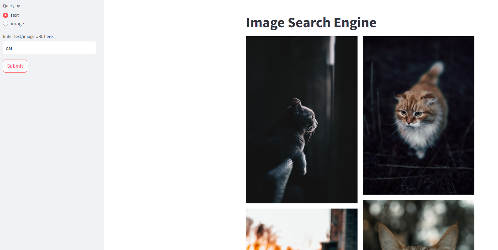
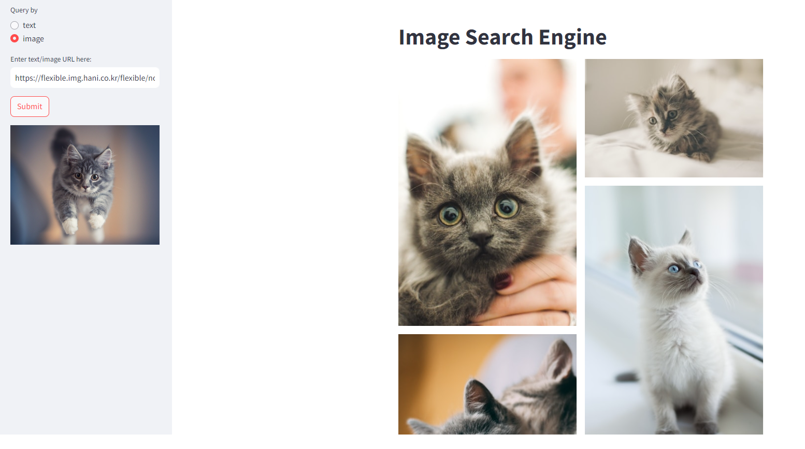

# Image Search using CLIP

[](https://share.streamlit.io/kingyiusuen/clip-image-search/)
[](https://github.com/psf/black)
[](https://github.com/kingyiusuen/clip-image-search/blob/master/.pre-commit-config.yaml)

[](https://github.com/kingyiusuen/clip-image-search/blob/master/LICENSE)

Retrieve images based on a query (text or image), using Open AI's pretrained CLIP model.

Text as query.


Image as query.


## Introduction

CLIP (Contrastive Language-Image Pre-Training) is a neural network trained on a variety of (image, text) pairs. It can map images and text into the same latent space, so that they can be compared using a similarity measure.


Extending the work in this [repository](https://github.com/haltakov/natural-language-image-search), I created a simple image search engine that can take both text and images as query. The search engine works as follows:

1. Use the image encoder to compute the feature vector of the images in the dataset.
2. Index the images in the following format:
   ```
   image_id: {"url": https://abc.com/xyz, "feature_vector": [0.1, 0.3, ..., 0.2]}
   ```
3. Compute the feature vector of the query. (Use text encoder if query is text. Use image encoder if query is image.)
4. Compute the cosine similarities between the feature vector of the query and the feature vector of the images in the dataset.
5. Return $k$ images that have the highest similarity.

I used the lite version of the [Unsplash dataset](https://github.com/unsplash/datasets) that contains 25,000 images. The [k-Nearest Neighbor search](https://docs.aws.amazon.com/elasticsearch-service/latest/developerguide/knn.html) is powered by Amazon Elasticsearch Service. I deployed the query service as an AWS Lambda function and put an API gateway in front of it. The frontend is developed using Streamlit.

## Possible Improvements

- The feature vector outputted by CLIP is a 32-bit floating point vector with 512 dimensions. To reduce storage cost and increase query speed, we may consider using a dimension reduction technique such as PCA to reduce the number of features. If we want to scale the system to billions of images, we may even consider binarizing the features, [as is done in Pinterest](https://arxiv.org/pdf/1702.04680.pdf).

## How to Use

### Install dependencies

```
pip install -e . --no-cache-dir
```

### Download the Unsplash dataset

```
python scripts/download_unsplash.py --image_width=480 --threads_count=32
```

This will download and extract a zip file that contains the metadata about the photos in the dataset. The script will use the URLs of the photos to download the actual images to `unsplash-dataset/photos`. The download may fail for a few images (see [this issue](https://github.com/unsplash/datasets/issues/37#issuecomment-854711074)). Since CLIP will downsample the images to 224 x 224 anyway, you may want to adjust the width of the downloaded images to reduce storage space. You may also want to increase the `threads_count` parameter to achieve a faster performance.

### Create index and upload image feature vectors to Elasticsearch

```
python scripts/ingest_data.py
```

The script will download the pretrained CLIP model and process the images by batch. It will use GPU if there is one.

### RUN docker-compose

```bash
docker-compose up -d
```

check username, password of elastic search

docker logs elasticsearch

you can check username and password of elasticsearch just once.

### RUN server

set environment values

- for example
```
# .env

ES_ENDPOINT = "http://localhost:9200"
ES_USERNAME = "elastic"
ES_PASSWORD = "xD==TAS=NP**3Ma_2dEM"

```

run server
```
poetry install
poetry run fastapi run clip_image_search\server\app.py
```

### Build Docker image
TO-DO

### Test the container with a GET request.

```
curl "http://localhost:8000/input_type=text&query=cat"
```

### Run Streamlit app

```
streamlit run streamlit_app.py
```




## Acknowledgement

- [open-ai/CLIP](https://github.com/openai/CLIP)
- [haltakov/natural-language-image-search](https://github.com/haltakov/natural-language-image-search)
- [clip-image-search](https://github.com/kingyiusuen/clip-image-search)

## 수정한 부분
- pip install -e . --no-cache-dir 명령어 실행 전에 가상환경을 만들고 python 버전은 3.12로 맞춰야 나중에 에러가 나지 않음
- docker-compose up -d 명령어 실행 전에 docker 어플리케이션을 실행했는지 확인할 것
- 원래의 clip_image_search 폴더 이름을 레포지토리 이름과 동일한 image_search로 바꿈 
- clip_image_search 폴더 내부 코드 중에서 clip_image_search라고 적힌 부분을 모두 image_search로 바꿈
- pyproject.toml
  - line 25 : [tool.poetry]의 name = "image_search"로 레포지토리 이름과 동일하게 수정함
  - line 28 : [tool.poetry]의 authors 변수 <> 안에 깃험 계정 이메일 주소를 채워넣음
  - 기타 수정 사항은 없었던 것 같음 (기억나지 않음) 
  - .env 파일 생성 시 ES_ENDPOINT = "http://localhost:9200"만 적고, ES_USERNAME과 ES_PASSWORD는 쓰지 않아도 됨 
